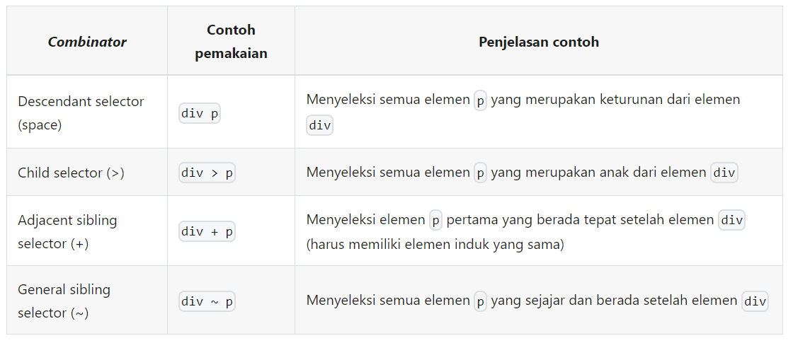
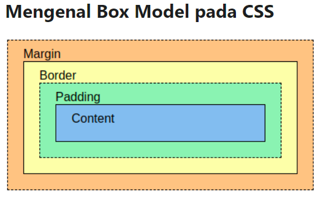

# iStock

Nama: Steven Faustin Orginata <br>
Kelas: PBP C <br>
NPM: 2206030855

iStock adalah sebuah aplikasi untuk mengukur/mengecek stok pada toko.
<br>
Link: [Adaptable](https://istock.adaptable.app/)

=================================================

<h2>Tugas 2 PBP Ganjil 2023/2024</h2>

Step:
* Membuat sebuah proyek Django baru.
* Membuat aplikasi dengan nama main pada proyek tersebut.
* Melakukan routing pada proyek agar dapat menjalankan aplikasi main.
* Membuat model pada aplikasi main dengan nama Item dan memiliki atribut wajib sebagai berikut.
  - name sebagai nama item dengan tipe CharField.
  - amount sebagai jumlah item dengan tipe IntegerField.
  - description sebagai deskripsi item dengan tipe TextField.
* Membuat sebuah fungsi pada views.py untuk dikembalikan ke dalam sebuah template HTML yang menampilkan nama aplikasi serta nama dan kelas kamu.
* Membuat sebuah routing pada urls.py aplikasi main untuk memetakan fungsi yang telah dibuat pada views.py.
* Melakukan deployment ke Adaptable terhadap aplikasi yang sudah dibuat sehingga nantinya dapat diakses oleh teman-temanmu melalui Internet.

<hr>

<h4>1. Jelaskan bagaimana cara kamu mengimplementasikan checklist di atas secara step-by-step (bukan hanya sekadar mengikuti tutorial).</h4>
Dalam membuat proyek Django, saya pertama membuat direktori di komputer saya. Kemudian, saya jalankan git init untuk membuat direktori bisa menjalankan git.

  ```
  git init
  ```
<br>
Selanjutnya, saya membuat file requirements.txt dimana isinya adalah module yang digunakan untuk membuat project.

  ```
  django
  gunicorn
  whitenoise
  psycopg2-binary
  requests
  urllib3
  ```
Setelah itu, saya jalankan command django-admin startproject "nama project". Setelah itu, saya membuat file .gitignore agar file yang tidak seharusnya di upload ke git tidak ter-upload. Untuk membuat proyek dengan nama main, maka saya menjalankan command django-admin startproject main. 
  ```
  django-admin startproject main
  ```
Struktur project akan seperti berikut
<br>


Setelah membuat project Django, hal pertama yang saya lakukan adalah mengubah ALLOWED HOSTS di file settings.py menjadi "*" dimana maksudnya adalah all. 
  ```
  ...
  ALLOWED_HOSTS = ["*"]
  ...
  ```
Saya juga menambahkan nama folder project, yaitu main, ke INSTALLED_APPS. 
  ```
  INSTALLED_APPS = [
    'django.contrib.admin',
    'django.contrib.auth',
    'django.contrib.contenttypes',
    'django.contrib.sessions',
    'django.contrib.messages',
    'django.contrib.staticfiles',
    'main',
]
  ```
Selain itu, saya menambahkan routing di file urls.py dimana pathnya akan mengarah ke main.
  ```
  urlpatterns = [
    path('admin/', admin.site.urls),
    path('', include('main.urls')),
]
  ```

Untuk membuat model, saya membuat file models.py di dalam folder project. Kemudian, saya membuat class Item (nama bebas) dengan param models(import django).Model. Di dalam class tersebut saya isi dengan atribut yang diinginkan. Misal, name = models.CharField() amount = models.IntegerField(), dst.
  ```
from django.db import models

class Item(models.Model):
    name = models.CharField(max_length=255)
    amount = models.IntegerField()
    date_added = models.DateField(auto_now_add=True)
    type = models.TextField()
    description = models.TextField()

  ```

Fungsi yang dibuat bernama show_main dengan param request. Isi dari function ini adalah context yang berisi nilai dari model yang ingin dibuat. Kemudian, di akhir akan di return request, nama file html, context.
  ```
def show_main(request):
    item = Item.objects.all()
    context = {
        'name': 'Steven Faustin Orginata',
        'class': 'PBP C',
        'items': item
    }

    return render(request, "main.html", context)
  ```

Routing dapat ditambahkan di urls.py dengan menambahkan line path(main, include main.urls) dimana isi urls.py di folder main adalah mendeklarasikan nama app, yaitu main, dan membuat path yang menerima func show_main pada views.py
  ```
urlpatterns = [
    path('', show_main, name='show_main'),
]
  ```

Step-step dalam melakukan deploy sama dengan tutorial yaitu, connect ke github repo, pilih python template, pilih postgreSQL database, pilih python ver dan jangan lupa masukkan start command, terakhir nyalakan port listener

<h4>2. Buatlah bagan yang berisi request client ke web aplikasi berbasis Django beserta responnya dan jelaskan pada bagan tersebut kaitan antara urls.py, views.py, models.py, dan berkas html.</h4>


<br>
Pada saat client me-request website di browser, browser akan jalan ke urls.py untuk melakukan url routing. Kemudian, dari urls akan jalan ke views.py karena ada func show_main yang berfungsi untuk menampilkan data. Dari views akan masuk ke models untuk melihat jenis data yang akan ditampilkan. Setelah itu, akan masuk ke database untuk mengambil data yang ingin ditampilkan. Dari database akan masuk ke models.py kemudian ke views.py untuk menyiapkan data yang akan ditampilkan. Terakhir, data tersebut akan dipass ke file template yaitu index.html dimana data akan ditampilkan disini. Index.html kemudian di pass ke browser yang akhirnya user dapat melihat data yang di-request.

<h4>3. Jelaskan mengapa kita menggunakan virtual environment? Apakah kita tetap dapat membuat aplikasi web berbasis Django tanpa menggunakan virtual environment?</h4>
Menurut saya, virtual environment berguna untuk menjalankan program/aplikasi web. Mengapa? karena terdapat beberapa depedensi setiap modul yang di-install. Modul-modul tersebut hanya bisa diakses dengan virtual environment
<br>
<h4>4. Jelaskan apakah itu MVC, MVT, MVVM dan perbedaan dari ketiganya.</h4>

  * MVC = Model-View-Controller <br>
  MVC berfokus pada menerima data yang diinput oleh user. Model dan view akan berubah mengikuti input user <br>
  * MVT = Model-View-Template <br>
  MVT berfokus pada menampilkan data. Ia tidak bisa menerima data/input dari user. <br>
  * MVVM = Model-View-ViewModel <br>
  MVVM berfokus pada menampilkan dan menerima data. <br>

<hr>

<h2>Tugas 3 PBP Ganjil 2023/2024</h2>

* Apa perbedaan antara form POST dan form GET dalam Django?
* Apa perbedaan utama antara XML, JSON, dan HTML dalam konteks pengiriman data?
* Mengapa JSON sering digunakan dalam pertukaran data antara aplikasi web modern?
* Jelaskan bagaimana cara kamu mengimplementasikan checklist di atas secara step-by-step (bukan hanya sekadar mengikuti tutorial).

<hr>

<h4>Apa perbedaan antara form POST dan form GET dalam Django?</h4>
Query POST dan GET berbeda dari request ke server. Query POST, sesuai namanya, yaitu memasukkan data ke server. Pada saat kita mengisi form dan mengklik tombol add item, kita melakukan query POST ke server untuk menyimpan data tersebut di server. Query GET, sesuai namanya, yaitu mengambil data dari server. Pada saat kita men-display data ada berapa item, kita melakukan query GET ke server untuk mendapatkan data tersebut kemudian data tersebut di display.
<br>

<h4>Apa perbedaan utama antara XML, JSON, dan HTML dalam konteks pengiriman data</h4>

* XML: menyimpan/mengirimkan data dalam urutan/hierarki root / parent dan child.
* JSON: menyimpan/mengirimkan data dalam bentuk yang lebih mudah dibaca
* HTML: bukan untuk menyimpan/mengirimkan data. HTML dipakai untuk membuat tampilan web. Data dikirimkan dalam bentuk webpage.

<h4>Mengapa JSON sering digunakan dalam pertukaran data antara aplikasi web modern</h4>
JSON sering digunakan karena struktur / format yang mudah dibaca. 

<h4>Jelaskan bagaimana cara kamu mengimplementasikan checklist di atas secara step-by-step (bukan hanya sekadar mengikuti tutorial).
</h4>
Sebelum membuat form, saya membuat file base.html untuk menjadi template html webpage berikut"nya.

  ```

<!DOCTYPE html>
<html lang="en">
    <head>
        <meta charset="UTF-8" />
        <meta
            name="viewport"
            content="width=device-width, initial-scale=1.0"
        />
        
        
    </head>

    <body>
        
        
    </body>
</html>

 file ini sebagai skeleton/template untuk halaman page lainnya 
  ```

Setelah membuat template, saya memasukkan template ke settings.py bagian template, DIRS

    TEMPLATES = [
      {
          'BACKEND': 'django.template.backends.django.DjangoTemplates',
          'DIRS': [BASE_DIR / 'templates'],
          'APP_DIRS': True,
          'OPTIONS': {
              'context_processors': [
                  'django.template.context_processors.debug',
                  'django.template.context_processors.request',
                  'django.contrib.auth.context_processors.auth',
                  'django.contrib.messages.context_processors.messages',
              ],
          },
      },
    ]
  

Kemudian, saya menambahkan button ke form dan table untuk mendisplay data

        <h4>Kamu menyimpan {{items.count}} item pada aplikasi ini</h4>
    <table>
        <tr>
            <th>Name</th>
            <th>Amount</th>
            <th>Type</th>
            <th>Description</th>
            <th>Date Added</th>
        </tr>

        
        <tr>
            <td>{{item.name}}</td>
            <td>{{item.amount}}</td>
            <td>{{item.type}}</td>
            <td>{{item.description}}</td>
            <td>{{item.date_added}}</td>
        </tr>
        
    </table>

    <br>

    <a href="">
        <button>
            Add New Item
        </button>
    </a>

Bisa dilihat di link button, dia akan redirect ke create_item page. Maka, saya perlu membuat create_item.html.

    

    
    <h1>Add New Item</h1>
    
    <form method="POST">
        
        <table>
            {{form.as_table}}
            <tr>
                <td></td>
                <td>
                    <input type="submit" value="Add Item"/>
                </td>
            </tr>
        </table>
    </form>
    
    
    

Selanjutnya, saya membuat function untuk mendisplay create_item di views.py

    def create_item(request):
    form = ItemForm(request.POST or None)

    if form.is_valid() and request.method == "POST":
        form.save()
        return HttpResponseRedirect(reverse('main:show_main'))

    context = {'form': form}
    return render(request, "create_item.html", context) 

Dari views ini lanjut ke urls.py untuk melakukan routing

    urlpatterns = [
    path('', show_main, name='show_main'),
    path('create-item', create_item, name="create_item"),
    ]

Selanjutnya, untuk membuat 5 fungsi views, saya membuat fungsi di views.py

    def show_html(request):
    data = Item.objects.all()
    return HttpResponse(serializers.serialize("html", data), content_type="application/html")

    def show_xml(request):
        data = Item.objects.all()
        return HttpResponse(serializers.serialize("xml", data), content_type="application/xml")
    
    def show_json(request):
        data = Item.objects.all()
        return HttpResponse(serializers.serialize("json", data), content_type="application/json")
    
    def show_xml_by_id(request, id):
        data = Item.objects.filter(pk=id)
        return HttpResponse(serializers.serialize("xml", data), content_type="application/xml")
    
    def show_json_by_id(request, id):
        data = Item.objects.filter(pk=id)
        return HttpResponse(serializers.serialize("json", data), content_type="application/json")

Dengan langkah yang sama seperti create_item, saya membuat routing function tersebut di urls.py

    urlpatterns = [
    path('', show_main, name='show_main'),
    path('create-item', create_item, name="create_item"),
    path('html/', show_html, name="show_html"),
    path('xml/', show_xml, name="show_xml"),
    path('json/', show_json, name="show_json"),
    path('xml/<int:id>/', show_xml_by_id, name="show_xml_by_id"),
    path('json/<int:id>/', show_json_by_id, name="show_json_by_id"),
    ]

=================================================

<h4>Screenshoot Postman</h4>

<h5>Mengakses http://localhost:8000/json</h5>


<h5>Mengakses http://localhost:8000/xml</h5>


<h5>Mengakses http://localhost:8000/html</h5>


<br>


<h5>Mengakses http://localhost:8000/json/1</h5>


<h5>Mengakses http://localhost:8000/xml/1</h5>


<hr>

<h2>Tugas 4 PBP Ganjil 2023/2024</h2>

* Apa itu Django UserCreationForm, dan jelaskan apa kelebihan dan kekurangannya?
* Apa perbedaan antara autentikasi dan otorisasi dalam konteks Django, dan mengapa keduanya penting?
* Apa itu cookies dalam konteks aplikasi web, dan bagaimana Django menggunakan cookies untuk mengelola data sesi pengguna?
* Apakah penggunaan cookies aman secara default dalam pengembangan web, atau apakah ada risiko potensial yang harus diwaspadai?
* Jelaskan bagaimana cara kamu mengimplementasikan checklist di atas secara step-by-step (bukan hanya sekadar mengikuti tutorial).

<hr>

<h4>Apa itu Django UserCreationForm, dan jelaskan apa kelebihan dan kekurangannya?</h4>
UserCreationForm adalah sebuah built-in form dari Django. Form ini akan meng-handle proses registrasi user langsung di web-browser. Keuntungannya, form ini mudah digunakan karena sudah dalam bentuk siap dipakai. Form ini juga sudah terintegrasi dengan Django sehingga kita bisa lebih mudah memakai nya di proyek kita. Kekurangannya, form ini hanya bisa dipakai di proyek berbasis Django.

<h4>Apa perbedaan antara autentikasi dan otorisasi dalam konteks Django, dan mengapa keduanya penting?</h4>
Autentikasi adalah sebuah proses untuk memverifikasi user yang ingin masuk ke aplikasi atau browser. User ini akan diverifikasi apakah username dan password nya sesuai. Autentikasi adalah sebuah proses untuk menjawab pertanyaan "Who are you". <br>
Otorisasi adalah sebuah proses untuk menentukan apa yang bisa dilakukan oleh user di web browser atau aplikasi.

<h4>Apa itu cookies dalam konteks aplikasi web, dan bagaimana Django menggunakan cookies untuk mengelola data sesi pengguna?</h4>
Cookies dalam konteks aplikasi web adalah sebuah informasi kecil tentang user yang membuka aplikasi tersebut. Informasi tersebut dikirim ke browser oleh web server, kemudian dikirim balik untuk akses webpage nantinya. Django memakai cookie seperti dictionary, dimana di cookie ini disimpan nama user, waktu terakhir akses, dll. Pada saat user mengakses kembali browser ini, browser akan mengambil cookie yang berisi data sesi pengguna.

<h4>Apakah penggunaan cookies aman secara default dalam pengembangan web, atau apakah ada risiko potensial yang harus diwaspadai?</h4>
Cookie tidak menyimpan kode program, tetapi data. Data-data yang disimpan juga bukan data personal. Namun, sebaiknya cookie tidak disimpan secara permanen. Hal ini untuk menghindari bahaya-bahaya dari cyber attack yang ingin mengambil cookie milik user lain.

<h4>Jelaskan bagaimana cara kamu mengimplementasikan checklist di atas secara step-by-step (bukan hanya sekadar mengikuti tutorial).</h4>
Pertama, saya mengimpor library yang diperlukan pada file views.py

```
from django.shortcuts import redirect
from django.contrib.auth.forms import UserCreationForm
from django.contrib import messages  
```
Fungsi pertama yang saya buat adalah fungsi registrasi
```
def register(request):
    form = UserCreationForm()

    if request.method == "POST":
        form = UserCreationForm(request.POST)
        if form.is_valid():
            form.save()
            messages.success(request, 'Your account has been successfully created!')
            return redirect('main:login')
    context = {'form':form}
    return render(request, 'register.html', context)
```
Kemudian, saya membuat file register.html dimana file ini berguna untuk template jika user ingin registrasi.
```



    <title>Register</title>


  

<div class = "login">
    
    <h1>Register</h1>  

        <form method="POST" >  
              
            <table>  
                {{ form.as_table }}  
                <tr>  
                    <td></td>
                    <td><input type="submit" name="submit" value="Daftar"/></td>  
                </tr>  
            </table>  
        </form>

      
        <ul>   
              
                <li>{{ message }}</li>  
                  
        </ul>   
    

</div>  


```

Selanjutnya, saya membuat fungsi login. Pertama, saya mengimpor library yang diperlukan di views.py

```
from django.contrib.auth import authenticate, login
```

Kemudian, saya membuat fungsi nya
```
def login_user(request):
    if request.method == 'POST':
        username = request.POST.get('username')
        password = request.POST.get('password')
        user = authenticate(request, username=username, password=password)
        if user is not None:
            login(request, user)
            return redirect('main:show_main')
        else:
            messages.info(request, 'Sorry, incorrect username or password. Please try again.')
    context = {}
    return render(request, 'login.html', context)
```

Sama seperti sebelumnya, saya membuat file login.html untuk template saat user ingin login.
```



    <title>Login</title>




<div class = "login">

    <h1>Login</h1>

    <form method="POST" action="">
        
        <table>
            <tr>
                <td>Username: </td>
                <td><input type="text" name="username" placeholder="Username" class="form-control"></td>
            </tr>
                    
            <tr>
                <td>Password: </td>
                <td><input type="password" name="password" placeholder="Password" class="form-control"></td>
            </tr>

            <tr>
                <td></td>
                <td><input class="btn login_btn" type="submit" value="Login"></td>
            </tr>
        </table>
    </form>

    
        <ul>
            
                <li>{{ message }}</li>
            
        </ul>
         
        
    Don't have an account yet? <a href="">Register Now</a>

</div>


```

Terakhir, saya membuat fungsi logout. Untuk logout, saya juga perlu mengimport logout dari library
```
from django.contrib.auth import logout
```

Kemudian, saya membuat fungsinya
```
def logout_user(request):
    logout(request)
    return redirect('main:login')
```

Terakhir, saya mengimpor fungsi-fungsi yang telah dibuat pada urls.py di aplikasi. Kemudian, saya buat path nya.
```
from main.views import show_main, create_item, show_html, show_xml, show_json, show_xml_by_id, show_json_by_id, register, login_user, logout_user, add_amount, sub_amount, delete_item 


path('register/', register, name="register"),
path('login/', login_user, name='login'),
path('logout/', logout_user, name="logout"),
```
Jangan lupa juga untuk membuat user harus login terlebih dahulu sebelum bisa mengakses browser. Hal ini bisa dilakukan dengan fungsi login_required dari Django. Pertama, import login_required
```
from django.contrib.auth.decorators import login_required
```
Kemudian, tulis kode login_required sebelum fungsi show_main.
```
@login_required(login_url='/login')
```
Fungsi ini membuat user harus mengakses url '/login' dahulu sebelum bisa mengakses browser.

Untuk membuat akun pengguna dan membuat dummy data bisa dengan manual input data di aplikasi web.

Untuk menghubungkan item dengan user bisa menggunakan foreign key. Pertama, kita perlu mengimpor User pada models.py. Kemudian, kita modifikasi model Item menjadi seperti berikut
```
from django.db import models
from django.contrib.auth.models import User

class Item(models.Model):
    user = models.ForeignKey(User, on_delete=models.CASCADE)
    name = models.CharField(max_length=255)
    amount = models.IntegerField()
    date_added = models.DateField(auto_now_add=True)
    type = models.TextField()
    description = models.TextField()
```
Kemudian, saya juga mengubah fungsi create_item menjadi seperti berikut.
```
def create_item(request):
    form = ItemForm(request.POST or None)

    if form.is_valid() and request.method == "POST":
        item = form.save(commit=False)
        item.user = request.user
        item.save()
        return HttpResponseRedirect(reverse('main:show_main'))

    context = {'form': form}
    return render(request, "create_item.html", context) 
```
Commit=False berarti kita tidak menyimpan langsung item ke database.

Untuk menampilkan last login pada halaman web bisa menggunakan cookie. Pertama, kita harus impor library yang dibutuhkan seperti
```
import datetime
from django.http import HttpResponseRedirect
from django.urls import reverse
```
Kemudian, saya memodifikasi fungsi login_user menjadi seperti berikut
```
if user is not None:
    login(request, user)
    response = HttpResponseRedirect(reverse("main:show_main")) 
    response.set_cookie('last_login', str(datetime.datetime.now()))
    return response
```
Jadi, pada saat user pertama kali membuka browser, browser akan set cookie dengan nama last_login dan value mengikuti waktu dibukanya browser tersebut.

Kemudian, cookie ini akan dimasukkan ke context pada show_main untuk ditampilkan di template html.
```
def show_main(request):
    item = Item.objects.filter(user=request.user)
    context = {
        'name': request.user.username,
        'class': 'PBP C',
        'items': item,
        'last_login': request.COOKIES['last_login']
    }
```
Kemudian, kita masukkan data last_login ke main.html agar bisa dilihat
```
<h5>Sesi terakhir login: {{ last_login }}</h5>
```

<hr>

<h2>Tugas 5 PBP Ganjil 2023/2024</h2>

* Jelaskan manfaat dari setiap element selector dan kapan waktu yang tepat untuk menggunakannya.
* Jelaskan HTML5 Tag yang kamu ketahui.
* Jelaskan perbedaan antara margin dan padding.
* Jelaskan perbedaan antara framework CSS Tailwind dan Bootstrap. Kapan sebaiknya kita menggunakan Bootstrap daripada Tailwind, dan sebaliknya?
* Jelaskan bagaimana cara kamu mengimplementasikan checklist di atas secara step-by-step (bukan hanya sekadar mengikuti tutorial).

<hr>

<h4>Jelaskan manfaat dari setiap element selector dan kapan waktu yang tepat untuk menggunakannya.</h4>
Element selector pada dasarnya melakukan styling pada tags HTML tertentu. Misalnya, kita ingin memberikan warna font untuk semua tags h4 di suatu dokumen HTML. Maka, di file CSS akan ada kode seperti berikut:

```
h4 {
    text-color: 'green';
}
```
Terdapat berbagai macam cara untuk men-select tags yang ingin dimodif. Cara paling biasa adalah menulis tags yang kita mau modif. Namun, bagaimana kalau kita hanya mau memodif tag h4 yang ada di dalam tag lain? Ada aturan untuk melakukan styling untuk tag tertentu.


<h4>Jelaskan HTML5 Tag yang kamu ketahui.</h4>
Terdapat banyak sekali tag HTML yang ada. Pada project ini, yang saya ingat ada tag sebagai berikut:

* html: tag untuk mendeklarasikan file html
* head: tag untuk mendeklarasikan header suatu file html. Biasa diisi dengan styleshee atau settings atau script
* body: tag untuk menyimpan isi dari konten HTML yang mau di-display
* h1-h6: tag untuk membuat header, font akan menjadi bold
* p: tag untuk menyimpan teks
* div: tag untuk memisahkan/mengelompokkan tag-tag yang lain
* table: tag untuk membuat table
* tr: tag untuk membuat baris pada tabel
* th: tag untuk membuat kolom (header) pada tabel
* td: tag untuk mendisplay pada tabel
* form: tag untuk membuat form
* input: tag untuk menyimpan/menerima input user
* button: tag yang berperan sebagai button

<h4>Jelaskan perbedaan antara margin dan padding.</h4>
Margin memisahkan / memberi jarak konten dengan ujung-ujung ukuran konten tersebut.
Padding untuk memberi jarak dari border yang dimiliki konten
Lebih jelasnya bisa dilihat di gambar berikut:



<h4>Jelaskan perbedaan antara framework CSS Tailwind dan Bootstrap. Kapan sebaiknya kita menggunakan Bootstrap daripada Tailwind, dan sebaliknya?</h4>
Secara garis besar, bootstrap menawarkan tampilan yang sudah jadi/didefinisikan jadi developer tinggal langsung memakai. Tailwind, menawarkan kesempatan pada developer untuk melakukan modifikasi pada komponen sesuai keinginan developer. Menurut saya, jika kita ingin tampilan yang langsung jadi, bootstrap lebih unggul dibandingkan tailwind. Tetapi, jika kita ingin tampilan yang lebih bebas, lebih kreatif, tailwind solusinya. Selain itu, faktor kemudahan untuk dipelajari juga patut diperhatikan. Bootstrap tergolong beginner-friendly karena developer tinggal langsung pakai ketimbang tailwind.

<h4>Jelaskan bagaimana cara kamu mengimplementasikan checklist di atas secara step-by-step (bukan hanya sekadar mengikuti tutorial).</h4>
Pertama, saya memasukkan bootstrap ke base.html

```
<link href="https://cdn.jsdelivr.net/npm/bootstrap@5.3.2/dist/css/bootstrap.min.css" rel="stylesheet" integrity="sha384-T3c6CoIi6uLrA9TneNEoa7RxnatzjcDSCmG1MXxSR1GAsXEV/Dwwykc2MPK8M2HN" crossorigin="anonymous">

<script src="https://code.jquery.com/jquery-3.6.0.min.js" integrity="sha384-KyZXEAg3QhqLMpG8r+J4jsl5c9zdLKaUk5Ae5f5b1bw6AUn5f5v8FZJoMxm6f5cH1" crossorigin="anonymous"></script>

<script src="https://cdn.jsdelivr.net/npm/@popperjs/core@2.11.8/dist/umd/popper.min.js" integrity="sha384-I7E8VVD/ismYTF4hNIPjVp/Zjvgyol6VFvRkX/vR+Vc4jQkC+hVqc2pM8ODewa9r" crossorigin="anonymous"></script>

<script src="https://cdn.jsdelivr.net/npm/bootstrap@5.3.2/dist/js/bootstrap.min.js" integrity="sha384-BBtl+eGJRgqQAUMxJ7pMwbEyER4l1g+O15P+16Ep7Q9Q+zqX6gSbd85u4mG4QzX+" crossorigin="anonymous"></script>
```
Jika sudah memasukkan bootstrap, kita hanya perlu membaca dokumentasi untuk styling yang kita inginkan. Contoh, untuk memperbagus tampilan saat login, saya menerapkan margin agar konten tidak menempel pada sisi atas browser.
```
<div class="login mx-0 my-5 text-center">

    <h1>Login</h1>

    <div class="py-2">
    ...
```
Selain itu, untuk menampilkan inventori, saya menggunakan tampilan Card yang sudah disediakan oleh Bootstrap.
```
<div class="card-container row justify-content-md-center"> 
    
    <div class="card col col-lg-4 mx-5 my-3" style="width: 18rem;">
        
        <div class="card-body">
            <h5 class="card-title">{{item.name}}</h5>
            <p>Amount:</p>
            <form action="" method="post" style="display: inline;">
                
                <input id="sub_button" type="submit" value="-" class=""/>
            </form>
            {{item.amount}}
            <form action="" method="post" style="display: inline;">
                
                <input id="add_button" type="submit" value="+" />
            </form>
            <p class="card-text mt-3">Type: {{item.type}}</p>
            <p class="card-text">{{item.description}}</p>
            <form action="" method="post">
                
                <button id="delete_button" type="submit">Delete</button>
            </form>
        </div>
    </div>
    
</div>
```
<hr>